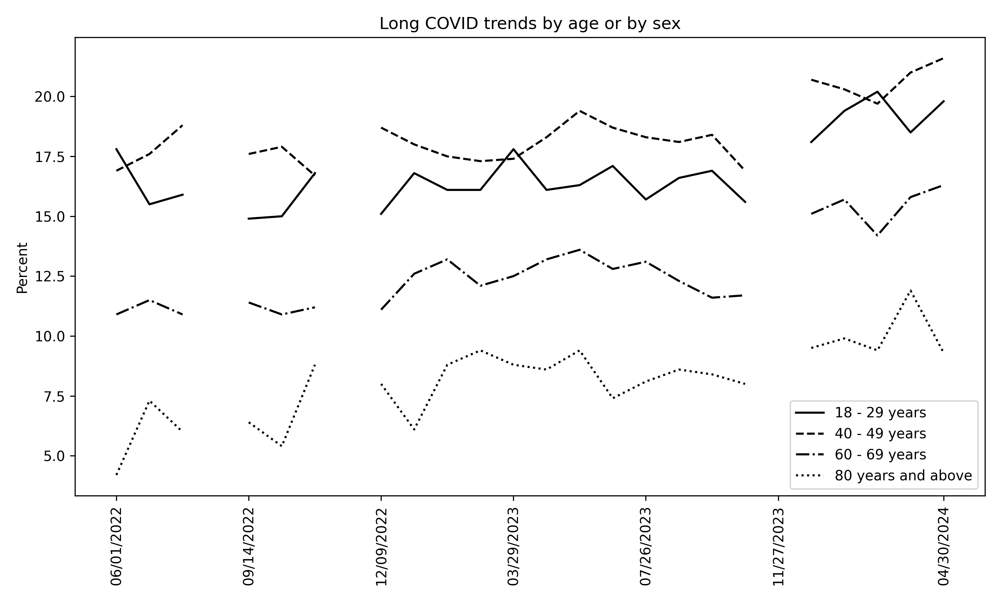

# postcovid

Download the dataset from the following CDC site:

https://data.cdc.gov/NCHS/Post-COVID-Conditions/gsea-w83j/about_data

Rename it to data.csv. Run the following command. 
Follow the instruction and obtain your desired outcome.

$ python postcovid.py

